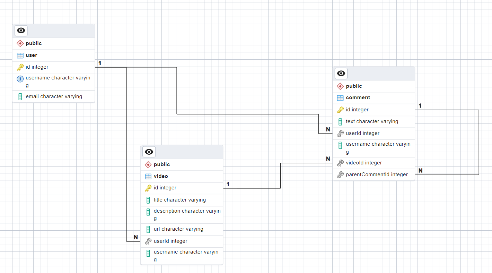

# Nombre del Proyecto

Breve descripción del proyecto, incluyendo su propósito y utilidad. Este proyecto utiliza NestJS, TypeORM, PostgreSQL, y Docker para crear una aplicación que gestiona usuarios, videos y comentarios.

## Configuración Inicial

Instrucciones sobre cómo clonar y configurar el proyecto para ejecutarlo localmente:

git clone https://example.com/your-project.git
cd your-project
Requisitos
Lista los requisitos necesarios para ejecutar el proyecto, como Node.js, Docker, etc.

Node.js (v14 o superior)
Docker
Docker Compose
Instalación y Ejecución
Instrucciones paso a paso para instalar y ejecutar el proyecto utilizando Docker:

bash
Copy code
npm install
docker-compose up --build
Estructura de la Base de Datos
Descripción de cómo se estructura la base de datos y qué representa cada tabla.

Diagrama Entidad-Relación

Descripción del Diagrama
Descripción breve de cada tabla y sus relaciones:

User
id: Clave primaria, identificador único para cada usuario.
username: Nombre de usuario único.
email: Correo electrónico del usuario.
Video
id: Clave primaria, identificador único para cada video.
title: Título del video.
description: Descripción del video.
url: URL donde está alojado el video.
userId: Clave foránea, identificador del usuario que subió el video.
Comment
id: Clave primaria, identificador único para cada comentario.
text: Texto del comentario.
userId: Clave foránea, identificador del usuario que hizo el comentario.
videoId: Clave foránea, identificador del video al que pertenece el comentario.
parentCommentId: Clave foránea opcional, identificador del comentario al que este comentario responde.