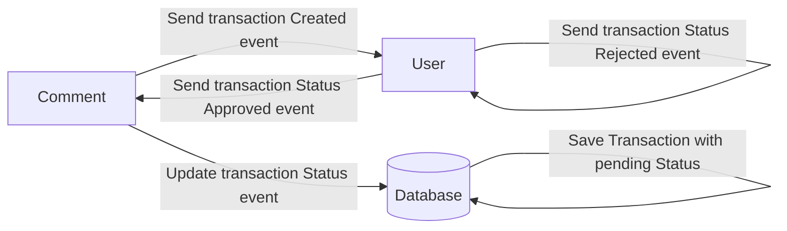

```mermaid
  flowchart LR
    Video -- Save Transaction with pending Status --> Video[(Database)]
    Comment --Send transaction Created event--> User
    User -- Send transaction Status Approved event--> Comment
    User -- Send transaction Status Rejected event--> User
    Comment -- Update transaction Status event--> Video[(Database)]
```
